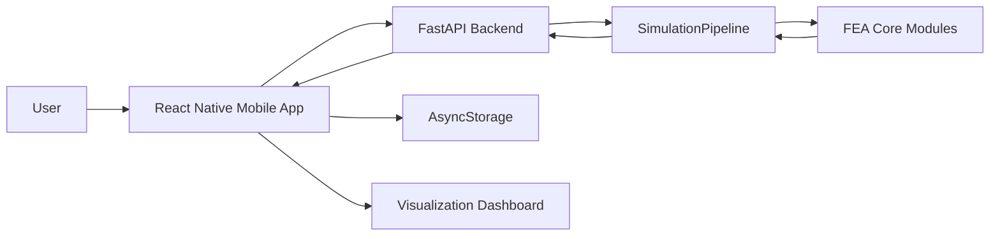
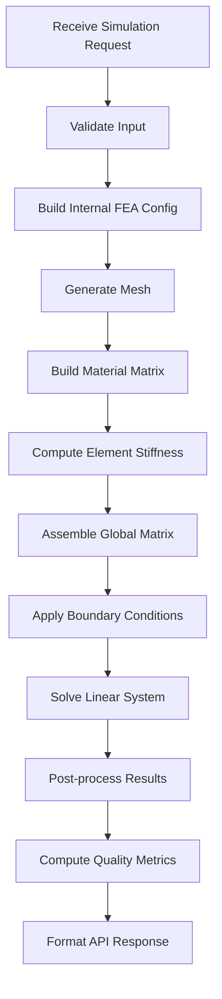

# Architecture — Mobile-based FEA Meshing System

## 1. Purpose

This document defines the target software architecture for the Mobile-based FEA Meshing System. It describes the main system components, responsibilities, data flow, API contract, simulation pipeline, storage strategy, testing strategy, and migration path from the current academic demo to a cleaner modular structure.

The architecture supports both:

1. A reliable academic demo.
2. Future extension into a more complete mobile-based FEA meshing and simulation information system.

---

## 2. Architectural Goals

The architecture should:

- Separate mobile UI from numerical computation.
- Keep FEA core independent from API and UI.
- Make simulation pipeline explicit and testable.
- Support project-based simulation workflows.
- Support local project/result persistence.
- Provide structured API request and response contracts.
- Enable result visualization on mobile using returned mesh/result data.
- Allow future extension to T3, Delaunay, custom polygons, contour, and export.

---

## 3. Target Repository Structure

The target repository should use a light refactor from the current structure:

```text
Mobile-based-FEA-Meshing-System/
├── Master_Context.md
├── Architecture.md
├── Design_System.md
├── README.md
├── api.py                         # Compatibility entrypoint for uvicorn api:app
├── backend/
│   ├── requirements.txt
│   ├── main.py
│   ├── schemas.py                 # Target / future schema extraction
│   ├── services/
│   │   └── simulation_service.py
│   └── fea_core/
│       ├── meshing.py
│       ├── material.py
│       ├── element_q4.py          # Target / future deeper extraction
│       ├── element_t3.py          # Target / future work
│       ├── assembly.py
│       ├── solver.py
│       ├── postprocess.py         # Target / future extraction
│       └── quality.py
└── base/                          # Current React Native app folder
    ├── package.json
    ├── app.js
    └── src/
        ├── screen/
        ├── services/
        │   └── feaApi.js
        ├── storage/
        │   └── projectStorage.js
        └── utils/
            └── exportSimulation.js
```

### Current-to-Target Mapping

```text
Current api.py
  → compatibility entrypoint importing backend.main:app

Current backend/main.py
  → FastAPI app and endpoint layer

Current backend/services/simulation_service.py
  → SimulationService and SimulationPipeline orchestration

Current ThuatToan_Final/step1_meshing.py
  → backend/fea_core/meshing.py compatibility wrapper

Current step2_get_D_matrix.py
  → backend/fea_core/material.py compatibility wrapper

Current step4_get_Ke.py
  → target backend/fea_core/element_q4.py future extraction

Current step5_assemble_global.py
  → backend/fea_core/assembly.py compatibility wrapper

Current step6_solve_system.py
  → backend/fea_core/solver.py compatibility wrapper

Current step7_plot_results.py
  → backend/fea_core/postprocess.py target or removed from API flow

Current base/
  → current mobile app folder; target may later be renamed to mobile/
```

### Current Implementation Status After Phase 4

As of the current implementation phase, the backend has been partially modularized while preserving the working academic demo.

Implemented structure:

```text
backend/
├── __init__.py
├── main.py
├── requirements.txt
├── services/
│   ├── __init__.py
│   └── simulation_service.py
└── fea_core/
    ├── __init__.py
    ├── meshing.py
    ├── material.py
    ├── assembly.py
    ├── solver.py
    └── quality.py
```

Important compatibility decisions:

- Root `api.py` remains available so the old command `uvicorn api:app --host 0.0.0.0 --port 8000` still works.
- New backend entrypoint `uvicorn backend.main:app --host 0.0.0.0 --port 8000` is also supported.
- `backend/services/simulation_service.py` contains `SimulationService` and a lightweight `SimulationPipeline` wrapper.
- `backend/fea_core/meshing.py`, `material.py`, `assembly.py`, and `solver.py` currently re-export the stable academic implementation from `ThuatToan_Final`.
- `backend/fea_core/quality.py` contains mesh quality helper functions used by the backend result response.
- The original `ThuatToan_Final` implementation is intentionally preserved during this safe refactor stage to avoid breaking the validated Q4 rectangle demo.

Remaining target items:

- Extract Pydantic schemas into `backend/schemas.py`.
- Extract Q4 element logic into `backend/fea_core/element_q4.py`.
- Add `backend/fea_core/postprocess.py` if post-processing grows beyond current service-level logic.
- Add T3/Delaunay support only after the Q4 academic demo remains stable.

---

## 4. High-level System Architecture



### Component Summary

| Component | Responsibility |
|---|---|
| Mobile App | User input, project workflow, visualization dashboard, local storage, JSON export |
| FastAPI Backend | API validation, simulation orchestration, response formatting |
| SimulationPipeline | Executes ordered FEA stages |
| FEA Core | Numerical computation and mesh/result processing |
| AsyncStorage | Local persistence of projects and simulation records |
| SVG Dashboard | Interactive visualization of mesh, deformation, contour, and quality indicators |

---

## 5. Backend Architecture

### Target Structure

```text
backend/
├── main.py
├── schemas.py
├── services/
│   └── simulation_service.py
└── fea_core/
    ├── meshing.py
    ├── material.py
    ├── element_q4.py
    ├── element_t3.py
    ├── assembly.py
    ├── solver.py
    ├── postprocess.py
    └── quality.py
```

### Backend Responsibilities

The backend is responsible for:

- Receiving simulation request from mobile app.
- Validating request body.
- Converting request schema into internal FEA configuration.
- Running simulation pipeline.
- Computing mesh, displacement, scalar results, and quality metrics.
- Returning structured API response.
- Providing meaningful error messages.

The backend should not be responsible for mobile-specific rendering. It should return structured numerical and geometric data.

---

## 6. Backend API Endpoints

### 6.1 Health Check

```http
GET /
```

Response:

```json
{
  "status": "success",
  "message": "FEM API is running"
}
```

### 6.2 Process Mesh / Run Simulation

```http
POST /api/process-mesh
```

Target request body:

```json
{
  "projectId": "optional-project-id",
  "geometry": {
    "type": "rectangle",
    "rectangle": {
      "width": 2.0,
      "height": 1.0
    },
    "polygon": null
  },
  "material": {
    "name": "Custom Material",
    "model": "linear_elastic_isotropic",
    "youngModulus": 20000000000,
    "poissonRatio": 0.3,
    "thickness": 0.1,
    "unitSystem": "SI"
  },
  "meshConfig": {
    "algorithm": "structured",
    "elementType": "quad",
    "nx": 5,
    "ny": 2,
    "minAngleDeg": 28.5,
    "maxArea": 0.05
  },
  "boundaryConditions": {
    "constraints": [
      {
        "type": "fixed",
        "target": "edge",
        "selector": { "edge": "left" },
        "dof": ["u", "v"]
      }
    ],
    "loads": [
      {
        "type": "point_load",
        "target": "coordinate",
        "coordinate": [2.0, 1.0],
        "force": [0, -10000]
      }
    ]
  },
  "solverSettings": {
    "analysisType": "linear_static",
    "scaleFactor": 200
  }
}
```

Target success response:

```json
{
  "status": "success",
  "data": {
    "mesh": {
      "nodes": [
        { "id": 0, "x": 0.0, "y": 0.0 }
      ],
      "elements": [
        { "id": 0, "type": "quad", "nodes": [0, 1, 2, 3] }
      ]
    },
    "results": {
      "deformedNodes": [
        { "id": 0, "x": 0.0, "y": 0.0 }
      ],
      "displacements": [
        { "id": 0, "ux": 0.0, "uy": 0.0 }
      ],
      "displacementMagnitude": [
        { "id": 0, "value": 0.0 }
      ],
      "maxDisplacement": {
        "nodeId": 0,
        "value": 0.0,
        "ux": 0.0,
        "uy": 0.0
      },
      "stressApproximation": []
    },
    "boundaryVisualization": {
      "fixedNodeIds": [],
      "loadMarkers": []
    },
    "quality": {
      "badElementCount": 0,
      "minArea": 0,
      "maxArea": 0,
      "maxAspectRatio": 0
    }
  },
  "metadata": {
    "processingTimeMs": 123,
    "nodeCount": 20,
    "elementCount": 10,
    "algorithm": "structured",
    "elementType": "quad"
  },
  "warnings": []
}
```

Target error response:

```json
{
  "status": "error",
  "error": {
    "code": "INVALID_GEOMETRY",
    "message": "Geometry width and height must be positive.",
    "details": {
      "field": "geometry.rectangle.width"
    },
    "suggestedAction": "Edit geometry dimensions and retry."
  }
}
```

---

## 7. Simulation Pipeline

### Pipeline Overview



### Current SimulationPipeline Interface

```python
class SimulationPipeline:
    def __init__(self, content):
        self.content = content

    def validate(self):
        pass

    def generate_mesh(self):
        pass

    def build_material(self):
        pass

    def assemble(self):
        pass

    def solve(self):
        pass

    def postprocess(self):
        pass

    def compute_quality(self):
        pass

    def to_response(self):
        pass

    def run(self):
        return (
            self.validate()
            .generate_mesh()
            .build_material()
            .assemble()
            .solve()
            .postprocess()
            .compute_quality()
            .to_response()
        )
```

### Pipeline Stage Responsibilities

| Stage | Responsibility |
|---|---|
| validate | Check geometry, material, mesh, boundary conditions and build internal FEM config |
| generate_mesh | Produce nodes and elements |
| build_material | Build D matrix for linear elastic isotropic material |
| assemble | Compute element stiffness and global stiffness matrix |
| solve | Apply boundary conditions and solve K · U = F |
| postprocess | Compute deformed nodes, displacement magnitude, max displacement, fixed node IDs, and load markers |
| compute_quality | Compute area, aspect ratio, bad element count |
| to_response | Convert internal NumPy arrays into JSON-safe objects |

---

## 8. FEA Core Modules

### Current Safe Refactor Status

The current `backend/fea_core` package is a compatibility layer. Its purpose is to provide stable backend-facing imports while the validated academic implementation remains in `ThuatToan_Final`.

| Module | Current status |
|---|---|
| `meshing.py` | Re-exports `MeshGenerator` from `ThuatToan_Final.step1_meshing` |
| `material.py` | Re-exports `get_D_matrix` from `ThuatToan_Final.step2_get_D_matrix` |
| `assembly.py` | Re-exports `assemble_K_global` from `ThuatToan_Final.step5_assemble_global` |
| `solver.py` | Re-exports `apply_bcs_and_solve` from `ThuatToan_Final.step6_solve_system` |
| `quality.py` | Contains mesh quality helper functions used by the API response |
| `element_q4.py` | Target / future deeper extraction |
| `element_t3.py` | Target / future work |
| `postprocess.py` | Target / future extraction if post-processing grows |

### Target Responsibilities

#### `meshing.py`

- Generate structured rectangular Q4 mesh.
- Generate structured triangular mesh.
- Generate Delaunay mesh for polygon points.
- Validate mesh orientation.
- Return nodes and elements in normalized internal format.

#### `material.py`

- Build material matrix D.
- Validate material constants.

#### `element_q4.py`

- Compute Q4 shape function derivatives.
- Compute Jacobian.
- Compute B matrix.
- Compute Q4 element stiffness matrix.

#### `element_t3.py`

- Compute T3 constant strain triangle stiffness.
- Support triangle mesh solving.

Target status: Target / Future Work depending on deadline.

#### `assembly.py`

- Dispatch element stiffness computation by element type.
- Assemble global stiffness matrix.
- Support Q4 and T3.

#### `solver.py`

- Build global force vector.
- Resolve node selectors for boundary conditions.
- Apply constraints.
- Solve linear static system.

#### `postprocess.py`

- Compute deformed node positions.
- Compute displacement magnitude.
- Compute maximum displacement.
- Compute basic stress approximation if implemented.

#### `quality.py`

- Compute element area.
- Compute aspect ratio.
- Count bad elements.
- Detect inverted or invalid elements.

---

## 9. Frontend Architecture

### Current Mobile Folder

The current React Native app is located in `base/`. The target documentation may refer to `mobile/`, but the current implementation keeps `base/` to avoid disrupting the validated Android build.

Current implemented frontend support includes:

```text
base/src/services/feaApi.js
base/src/storage/projectStorage.js
base/src/utils/exportSimulation.js
base/src/screen/MyProjects.js
base/src/screen/GeometryEditor.js
base/src/screen/ProcessingStatus.js
base/src/screen/MeshQualityView.js
```

### Target Structure

```text
mobile/src/
├── navigation/
│   ├── AppNavigator.js
│   └── BottomTabs.js
├── context/
│   └── SimulationContext.js
├── screens/
│   ├── ProjectHomeScreen.js
│   ├── GeometryEditorScreen.js
│   ├── MaterialLoadSetupScreen.js
│   ├── MeshSettingsScreen.js
│   ├── ProcessingScreen.js
│   └── ResultsDashboardScreen.js
├── components/
│   ├── Canvas/
│   ├── Cards/
│   ├── Forms/
│   ├── Dashboard/
│   └── Feedback/
├── services/
│   └── feaApi.js
├── storage/
│   └── projectStorage.js
├── constants/
│   └── theme.js
└── utils/
```

### Navigation

Target navigation:

```text
Bottom Tabs:
- Projects
- Simulate
- Library
- Settings

Stack Flow inside Simulate:
Geometry Editor
→ Material & Load Setup
→ Mesh Settings
→ Processing
→ Results / Post-processing
```

React Navigation Stack + Bottom Tabs is the target architecture.

### State Management

Use React Context for:

- Current project.
- Current simulation input.
- Current simulation result.
- Save/export actions.
- Project history refresh.

For the current demo, local component state is acceptable. The target architecture should move shared simulation state into context.

### API Service

Current implementation:

```text
base/src/services/feaApi.js
```

Target if the app is later renamed/restructured:

```text
mobile/src/services/feaApi.js
```

Target service behavior:

```javascript
const API_BASE_URL = "http://10.0.2.2:8000";

export async function runSimulation(simulationRequest) {
  const response = await fetch(`${API_BASE_URL}/api/process-mesh`, {
    method: "POST",
    headers: { "Content-Type": "application/json" },
    body: JSON.stringify(simulationRequest),
  });

  const payload = await response.json();

  if (!response.ok || payload.status === "error") {
    throw payload.error || new Error("Simulation failed");
  }

  return payload;
}
```

---

## 10. Local Storage Architecture

### Storage Technology

Use AsyncStorage.

### Current Storage Service

Current implementation:

```text
base/src/storage/projectStorage.js
```

### Storage Keys

```text
fea.projects = [...]
fea.simulations.<projectId> = [...]
```

### Project Storage Example

```json
[
  {
    "id": "project-001",
    "name": "Cantilever Beam Demo",
    "description": "Rectangle Q4 beam simulation",
    "createdAt": "2026-05-15T10:00:00Z",
    "updatedAt": "2026-05-15T10:05:00Z",
    "lastSimulationStatus": "success",
    "thumbnail": null
  }
]
```

### Simulation Storage Example

```json
[
  {
    "id": "sim-001",
    "projectId": "project-001",
    "name": "Coarse Mesh Run",
    "input": {},
    "output": {},
    "metadata": {},
    "createdAt": "2026-05-15T10:05:00Z"
  }
]
```

---

## 11. Visualization Architecture

The backend returns mesh and result data. The frontend renders the visualization using SVG.

This keeps the mobile app interactive and avoids sending static images as the primary result format.

### Current Implemented Visualization Layers

- Original mesh.
- Deformed mesh.
- Fixed support markers.
- Load vectors.
- Displacement contour lite.
- Bad element highlights.

### Target Visualization Layers

- Original mesh.
- Deformed mesh.
- Fixed support markers.
- Load vectors.
- Displacement contour.
- Node IDs.
- Element IDs.
- Bad element highlights.

### Dashboard Data Source

```json
{
  "mesh": {},
  "results": {},
  "boundaryVisualization": {},
  "quality": {},
  "metadata": {}
}
```

---

## 12. Error Handling Architecture

### Backend Error Categories

| Error Code | Meaning |
|---|---|
| INVALID_GEOMETRY | Geometry input is missing or invalid |
| INVALID_MATERIAL | Material constants are invalid |
| INVALID_MESH_CONFIG | Mesh settings are invalid |
| UNSUPPORTED_ELEMENT_TYPE | Requested element type is not supported |
| MESH_GENERATION_FAILED | Mesh algorithm failed |
| SINGULAR_MATRIX | Solver could not solve due to insufficient constraints |
| SOLVER_FAILED | Generic solver failure |
| INTERNAL_ERROR | Unexpected backend error |

### Frontend Error States

Frontend should show friendly technical cards:

- Server unreachable.
- Invalid geometry.
- Mesh generation failed.
- Solver failed.
- Unsupported feature.
- Export failed.

Each error should offer an action:

- Retry.
- Edit input.
- Go back.
- View details.

---

## 13. Testing Strategy

### FEA Core Unit Tests

Minimum tests:

- D matrix shape and symmetry.
- Structured Q4 mesh node/element count.
- Q4 element stiffness matrix is 8x8.
- Global stiffness matrix has expected size.
- Solver returns displacement vector of length `2 * nodeCount`.
- Invalid material input raises validation error.

### API Smoke Tests

Minimum tests:

- `GET /` returns success.
- `POST /api/process-mesh` with valid rectangle returns mesh and results.
- Invalid geometry returns structured error.

### Mobile Manual Tests

Manual checklist:

- App opens Project Home.
- User can enter geometry and material parameters.
- Processing screen calls API.
- Server unreachable state appears when backend is off.
- Result screen displays mesh.
- Export JSON action works if implemented.
- Saved project appears in project history if storage is implemented.

---

## 14. Deployment and Demo Setup

### Android Emulator

Recommended backend command after Phase 4:

```bash
uvicorn backend.main:app --host 0.0.0.0 --port 8000
```

Compatibility backend command:

```bash
uvicorn api:app --host 0.0.0.0 --port 8000
```

Mobile API base URL:

```text
http://10.0.2.2:8000
```

### Physical Android Device

Backend runs on laptop:

```bash
uvicorn backend.main:app --host 0.0.0.0 --port 8000
```

Mobile API base URL:

```text
http://<laptop-lan-ip>:8000
```

The phone and laptop must be on the same network.

---

## 15. Migration Plan

### Step 1 — Preserve Current Working Demo

- Do not break existing Q4 rectangle flow.
- Keep current API endpoint available.
- Keep current mobile screen flow working.

Status: Implemented.

### Step 2 — Create Backend Folder

- Move `api.py` behavior to `backend/main.py`.
- Move/copy requirements into `backend/requirements.txt`.
- Keep root `api.py` as compatibility entrypoint.

Status: Implemented.

### Step 3 — Extract Simulation Service

- Create `services/simulation_service.py`.
- Move request-to-config mapping out of API handler.
- Create `SimulationPipeline`.

Status: Implemented.

### Step 4 — Rename FEA Core Modules

- Create `backend/fea_core` compatibility layer.
- Keep wrappers for current `ThuatToan_Final` implementation.
- Move deeper Q4 element logic later only if needed.

Status: Partially implemented.

### Step 5 — Improve Frontend API Layer

- Create `base/src/services/feaApi.js`.
- Replace direct fetch calls inside screens.

Status: Implemented.

### Step 6 — Add Local Storage

- Add AsyncStorage.
- Create project and simulation storage helpers.

Status: Implemented.

### Step 7 — Add Dashboard Enhancements

- Add layer toggles.
- Add mesh quality cards.
- Add displacement magnitude visualization.
- Add JSON export.
- Add simulation metadata and boundary summary panels.

Status: Implemented for current academic demo.

---

## 16. Architecture Status Matrix

| Feature | Status | Priority |
|---|---|---|
| React Native mobile app | Implemented | P0 |
| FastAPI backend | Implemented | P0 |
| Q4 rectangle pipeline | Implemented | P0 |
| Structured API response | Implemented | P0 |
| SimulationPipeline object | Implemented | P0 |
| Backend service layer | Implemented | P0 |
| Backend FEA core compatibility layer | Implemented | P0 |
| AsyncStorage project history | Implemented | P1 |
| Mesh quality metrics | Implemented | P1 |
| JSON export | Implemented | P1 |
| Result layer toggles | Implemented | P1 |
| Displacement contour lite | Implemented | P1 |
| Simulation metadata dashboard | Implemented | P1 |
| Boundary summary dashboard | Implemented | P1 |
| React Navigation | Target | P1 |
| Custom polygon input | Target | P2 |
| T3 element support | Target | P2 |
| Delaunay polygon mesh | Target | P2 |
| Stress approximation | Target | P2 |
| Engineering-grade validation | Future Work | Future |
