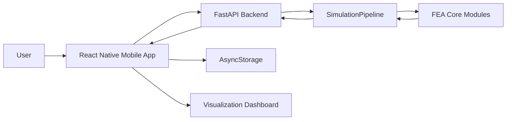
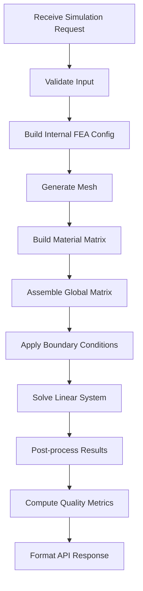

# Architecture — Mobile-based FEA Meshing System

## 1. Purpose

This document defines the current and target software architecture for the Mobile-based FEA Meshing System. The project is an academic mobile information-system application for creating geometry, generating FEA meshes, running a lightweight linear-static simulation, visualizing mesh/result data, storing simulation history locally, and exporting simulation packages.

The current implementation supports:

- Structured rectangular Q4 mesh.
- Structured rectangular T3 mesh.
- Custom polygon Delaunay T3 mesh.
- Linear elastic isotropic material model.
- Fixed-left-edge boundary condition.
- Point load simulation.
- Mesh/result visualization dashboard.
- Local project/simulation persistence.
- JSON export package.

---

## 2. Architectural Goals

The architecture should:

- Separate mobile UI from numerical computation.
- Keep FEA core independent from API and UI.
- Make simulation pipeline explicit and testable.
- Support project-based simulation workflows.
- Support local project/result persistence.
- Provide structured API request and response contracts.
- Enable result visualization on mobile using returned mesh/result data.
- Support Q4, T3, Delaunay/custom polygon demo flows.
- Keep engineering claims appropriate for an educational academic demo.

---

## 3. Current Repository Structure

```text
Mobile-based-FEA-Meshing-System/
├── Master_Context.md
├── Architecture.md
├── Design_System.md
├── Coding_Rules.md
├── README.md
├── api.py                         # Compatibility entrypoint for uvicorn api:app
├── ThuatToan_Final/               # Original academic FEA implementation
├── backend/
│   ├── __init__.py
│   ├── requirements.txt
│   ├── main.py
│   ├── services/
│   │   ├── __init__.py
│   │   └── simulation_service.py
│   └── fea_core/
│       ├── __init__.py
│       ├── meshing.py
│       ├── material.py
│       ├── element_q4.py
│       ├── element_t3.py
│       ├── assembly.py
│       ├── solver.py
│       └── quality.py
└── base/                          # Current React Native app folder
    ├── package.json
    ├── app.js
    └── src/
        ├── screen/
        │   ├── MyProjects.js
        │   ├── GeometryEditor.js
        │   ├── ProcessingStatus.js
        │   └── MeshQualityView.js
        ├── services/
        │   └── feaApi.js
        ├── storage/
        │   └── projectStorage.js
        └── utils/
            └── exportSimulation.js
```

---

## 4. Current-to-Target Mapping

```text
api.py
  → compatibility entrypoint importing backend.main:app

backend/main.py
  → FastAPI app and endpoint layer

backend/services/simulation_service.py
  → SimulationService and SimulationPipeline orchestration

backend/fea_core/meshing.py
  → compatibility wrapper for MeshGenerator from ThuatToan_Final.step1_meshing

backend/fea_core/material.py
  → compatibility wrapper for get_D_matrix from ThuatToan_Final.step2_get_D_matrix

backend/fea_core/element_q4.py
  → compatibility wrapper for Q4 element stiffness from ThuatToan_Final.step4_get_Ke

backend/fea_core/element_t3.py
  → implemented T3/CST element stiffness

backend/fea_core/assembly.py
  → implemented Q4/T3 dispatching global assembly

backend/fea_core/solver.py
  → compatibility wrapper for apply_bcs_and_solve from ThuatToan_Final.step6_solve_system

backend/fea_core/quality.py
  → implemented mesh quality helpers

base/
  → current mobile app folder; target may later be renamed to mobile/
```

---

## 5. High-level System Architecture



| Component | Responsibility |
|---|---|
| Mobile App | Geometry input, mesh settings, project workflow, visualization dashboard, local storage, JSON export |
| FastAPI Backend | API validation, simulation orchestration, response formatting |
| SimulationPipeline | Executes ordered FEA stages |
| FEA Core | Meshing, material matrix, Q4/T3 element stiffness, assembly, solver, quality helpers |
| AsyncStorage | Local persistence of projects and simulation records |
| SVG Dashboard | Interactive visualization of mesh, deformation, contour, boundary markers, quality indicators |

---

## 6. Backend Architecture

### Current Backend Structure

```text
backend/
├── main.py
├── services/
│   └── simulation_service.py
└── fea_core/
    ├── meshing.py
    ├── material.py
    ├── element_q4.py
    ├── element_t3.py
    ├── assembly.py
    ├── solver.py
    └── quality.py
```

### Backend Responsibilities

The backend is responsible for:

- Receiving simulation request from the mobile app.
- Validating geometry, material, mesh, boundary, and solver settings.
- Converting request body into internal FEA configuration.
- Running simulation pipeline.
- Supporting Q4 and T3 element assembly.
- Supporting structured rectangle mesh and custom polygon Delaunay T3 mesh.
- Computing mesh, displacement, displacement magnitude, boundary markers, and quality metrics.
- Returning structured API response.
- Providing meaningful error messages.

The backend does not render mobile UI. It returns structured numerical and geometric data.

---

## 7. Backend API Endpoints

### 7.1 Health Check

```http
GET /
```

Response:

```json
{
  "status": "success",
  "message": "FEM API is running"
}
```

### 7.2 Process Mesh / Run Simulation

```http
POST /api/process-mesh
```

### Supported request modes

| Geometry | Algorithm | Element Type | Status |
|---|---|---|---|
| Rectangle | structured | quad / Q4 | Implemented |
| Rectangle | structured | t3 / triangle | Implemented |
| Polygon | delaunay | t3 / triangle | Implemented |
| Polygon | delaunay | quad | Not supported |

### Rectangle Q4/T3 request example

```json
{
  "geometry": {
    "type": "rectangle",
    "rectangle": {
      "width": 2.0,
      "height": 1.0
    }
  },
  "material": {
    "youngModulus": 20000000000,
    "poissonRatio": 0.3,
    "thickness": 0.1
  },
  "meshConfig": {
    "algorithm": "structured",
    "elementType": "quad",
    "nx": 5,
    "ny": 2,
    "minAngleDeg": 28.5,
    "maxArea": 0.05
  },
  "boundaryConditions": {
    "constraints": [
      {
        "type": "fixed",
        "target": "edge",
        "selector": { "edge": "left" },
        "dof": ["u", "v"]
      }
    ],
    "loads": [
      {
        "type": "point_load",
        "target": "coordinate",
        "coordinate": [2.0, 1.0],
        "force": [0, -10000]
      }
    ]
  },
  "solverSettings": {
    "analysisType": "linear_static",
    "scaleFactor": 200
  }
}
```

For rectangle T3, change:

```json
{
  "meshConfig": {
    "algorithm": "structured",
    "elementType": "t3"
  }
}
```

### Custom polygon Delaunay T3 request example

```json
{
  "geometry": {
    "type": "polygon",
    "polygon": {
      "points": [
        [0, 0],
        [2, 0],
        [2, 1],
        [1, 1.4],
        [0, 1]
      ]
    }
  },
  "material": {
    "youngModulus": 20000000000,
    "poissonRatio": 0.3,
    "thickness": 0.1
  },
  "meshConfig": {
    "algorithm": "delaunay",
    "elementType": "t3",
    "nx": 5,
    "ny": 2,
    "minAngleDeg": 28.5,
    "maxArea": 0.05
  },
  "boundaryConditions": {
    "constraints": [
      {
        "type": "fixed",
        "target": "edge",
        "selector": { "edge": "left" },
        "dof": ["u", "v"]
      }
    ],
    "loads": [
      {
        "type": "point_load",
        "target": "coordinate",
        "coordinate": [2, 1],
        "force": [0, -10000]
      }
    ]
  },
  "solverSettings": {
    "analysisType": "linear_static",
    "scaleFactor": 200
  }
}
```

### Success response shape

```json
{
  "status": "success",
  "data": {
    "mesh": {
      "nodes": [],
      "elements": []
    },
    "results": {
      "deformedNodes": [],
      "displacements": [],
      "displacementMagnitude": [],
      "maxDisplacement": {
        "nodeId": 0,
        "value": 0.0,
        "ux": 0.0,
        "uy": 0.0
      }
    },
    "boundaryVisualization": {
      "fixedNodeIds": [],
      "loadMarkers": []
    },
    "quality": {
      "badElementCount": 0,
      "minArea": 0,
      "maxArea": 0,
      "maxAspectRatio": 0,
      "elementMetrics": []
    }
  },
  "metadata": {
    "processingTimeMs": 123,
    "nodeCount": 20,
    "elementCount": 10,
    "algorithm": "structured",
    "elementType": "quad",
    "geometryType": "rectangle",
    "scaleFactor": 200,
    "meshInfo": {}
  },
  "warnings": []
}
```

### Error response shape

```json
{
  "status": "error",
  "error": {
    "code": "INVALID_INPUT",
    "message": "Only Q4 quadrilateral and T3 triangular elements are supported.",
    "details": {},
    "suggestedAction": "Edit geometry, material, boundary condition, or mesh settings and retry."
  }
}
```

---

## 8. Simulation Pipeline



Current interface:

```python
class SimulationPipeline:
    def run(self):
        return (
            self.validate()
            .generate_mesh()
            .build_material()
            .assemble()
            .solve()
            .postprocess()
            .compute_quality()
            .to_response()
        )
```

| Stage | Responsibility |
|---|---|
| validate | Check input and build internal FEM config |
| generate_mesh | Generate Q4/T3 structured mesh or Delaunay polygon mesh |
| build_material | Build D matrix for linear elastic isotropic material |
| assemble | Dispatch Q4/T3 element stiffness and assemble global K |
| solve | Apply boundary conditions and solve K · U = F |
| postprocess | Compute deformed nodes, displacement magnitude, max displacement, boundary markers |
| compute_quality | Compute area, aspect ratio, bad element count |
| to_response | Convert NumPy arrays into JSON-safe response |

---

## 9. FEA Core Modules

| Module | Current status |
|---|---|
| `meshing.py` | Compatibility wrapper for `MeshGenerator`; supports structured rectangle and Delaunay/custom polygon path from original implementation |
| `material.py` | Compatibility wrapper for material D matrix |
| `element_q4.py` | Compatibility wrapper for Q4 element stiffness |
| `element_t3.py` | Implemented T3/CST element stiffness |
| `assembly.py` | Implemented Q4/T3 global assembly dispatcher |
| `solver.py` | Compatibility wrapper for applying BCs and solving |
| `quality.py` | Implemented mesh quality helpers |
| `postprocess.py` | Target/future extraction if post-processing grows |

### Current numerical scope

- 2D linear static educational demo.
- Plane-stress/plane-strain behavior follows the existing D-matrix implementation.
- Q4 uses the original academic implementation.
- T3 uses constant strain triangle stiffness.
- Custom polygon uses Delaunay triangulation over provided points.
- Current custom polygon demo works best with convex or simple point sets; robust clipping/filtering for concave polygons is future hardening.

---

## 10. Frontend Architecture

The current React Native app is located in `base/`.

Current implemented frontend support:

```text
base/src/services/feaApi.js
base/src/storage/projectStorage.js
base/src/utils/exportSimulation.js
base/src/screen/MyProjects.js
base/src/screen/GeometryEditor.js
base/src/screen/ProcessingStatus.js
base/src/screen/MeshQualityView.js
```

### Geometry Editor current modes

| UI mode | Backend geometry | Algorithm | Element type |
|---|---|---|---|
| Rectangle + Q4 | rectangle | structured | quad |
| Rectangle + T3 | rectangle | structured | t3 |
| Custom Polygon | polygon | delaunay | t3 |

Custom polygon input currently uses editable text points in `x,y` format, one point per line. This is intentionally simple and stable for academic demo purposes.

### Current project system features

- Project history from AsyncStorage.
- Project search.
- Project rename.
- Project delete.
- Project detail modal.
- Latest mesh preview.
- Latest simulation summary.
- Input parameters summary.

---

## 11. Local Storage Architecture

Storage technology: AsyncStorage.

Current storage service:

```text
base/src/storage/projectStorage.js
```

Storage keys:

```text
fea.projects = [...]
fea.simulations.<projectId> = [...]
```

Each project stores:

```json
{
  "id": "project-001",
  "name": "Rectangle 2m × 1m Q4",
  "description": "STRUCTURED Q4 mesh, NX=5, NY=2",
  "createdAt": "2026-05-15T10:00:00Z",
  "updatedAt": "2026-05-15T10:05:00Z",
  "lastSimulationStatus": "success",
  "thumbnail": null
}
```

Each simulation stores:

```json
{
  "id": "simulation-001",
  "projectId": "project-001",
  "name": "Run: 10 Q4 elements, 18 nodes",
  "input": {},
  "output": {},
  "metadata": {},
  "createdAt": "2026-05-15T10:05:00Z"
}
```

---

## 12. Visualization Architecture

The backend returns mesh and result data. The frontend renders the visualization using SVG.

Current implemented visualization layers:

- Original mesh.
- Deformed mesh.
- Fixed support markers.
- Load vectors.
- Displacement contour lite.
- Bad element highlights.

The same dashboard supports Q4 and T3 because elements are rendered based on their returned node list.

Dashboard data source:

```json
{
  "mesh": {},
  "results": {},
  "boundaryVisualization": {},
  "quality": {},
  "metadata": {}
}
```

---

## 13. Export Architecture

Current export helper:

```text
base/src/utils/exportSimulation.js
```

Current export version:

```text
1.1
```

Export package includes:

- Project summary.
- Geometry input.
- Material input.
- Boundary conditions.
- Mesh config including algorithm and element type.
- Solver settings.
- Backend output mesh/result/quality data.
- Metadata including geometry type, algorithm, element type, processing time, node count, and element count.

---

## 14. Error Handling Architecture

| Error Code | Meaning |
|---|---|
| INVALID_INPUT | Generic validation failure |
| INVALID_GEOMETRY | Geometry input is missing or invalid |
| INVALID_MATERIAL | Material constants are invalid |
| INVALID_MESH_CONFIG | Mesh settings are invalid |
| UNSUPPORTED_ELEMENT_TYPE | Requested element type is not supported |
| MESH_GENERATION_FAILED | Mesh algorithm failed |
| SINGULAR_MATRIX | Solver could not solve due to insufficient constraints |
| SOLVER_FAILED | Generic solver failure |
| INTERNAL_ERROR | Unexpected backend error |

Frontend should show friendly technical cards with actions such as retry, edit input, go back, or view details.

---

## 15. Testing Strategy

### Backend/manual smoke tests

- `GET /` returns success.
- Rectangle Q4 returns success.
- Rectangle T3 returns success.
- Custom polygon Delaunay T3 returns success.
- Invalid polygon points return structured error.
- Unsupported polygon Q4 request returns structured error.

### Mobile manual tests

- App opens Project Home.
- Rectangle Q4 flow works.
- Rectangle T3 flow works.
- Custom Polygon Delaunay T3 flow works.
- Processing screen calls API.
- Server unreachable state appears when backend is off.
- Result screen displays mesh and dashboard data.
- Layer toggles work.
- Contour layer works.
- Export JSON includes geometry, element type, algorithm, result, and metadata.
- Saved project appears in project history.
- Search, rename, delete, and project detail mesh preview work.

---

## 16. Deployment and Demo Setup

Recommended backend command:

```bash
uvicorn backend.main:app --host 0.0.0.0 --port 8000
```

Compatibility backend command:

```bash
uvicorn api:app --host 0.0.0.0 --port 8000
```

Android emulator API base URL:

```text
http://10.0.2.2:8000
```

Physical Android device API base URL:

```text
http://<laptop-lan-ip>:8000
```

The phone and laptop must be on the same network.

---

## 17. Architecture Status Matrix

| Feature | Status | Priority |
|---|---|---|
| React Native mobile app | Implemented | P0 |
| FastAPI backend | Implemented | P0 |
| Q4 rectangle pipeline | Implemented | P0 |
| T3 rectangle pipeline | Implemented | P0 |
| Delaunay custom polygon T3 pipeline | Implemented | P0 |
| Structured API response | Implemented | P0 |
| SimulationPipeline object | Implemented | P0 |
| Backend service layer | Implemented | P0 |
| Backend FEA core compatibility layer | Implemented | P0 |
| Q4/T3 assembly dispatcher | Implemented | P0 |
| AsyncStorage project history | Implemented | P1 |
| Project search/rename/delete | Implemented | P1 |
| Project detail mesh preview | Implemented | P1 |
| Mesh quality metrics | Implemented | P1 |
| JSON export package v1.1 | Implemented | P1 |
| Result layer toggles | Implemented | P1 |
| Displacement contour lite | Implemented | P1 |
| Simulation metadata dashboard | Implemented | P1 |
| Boundary summary dashboard | Implemented | P1 |
| React Navigation | Target | P1 |
| Stress approximation | Target | P2 |
| Robust concave polygon clipping/filtering | Future Work | Future |
| Engineering-grade validation | Future Work | Future |
