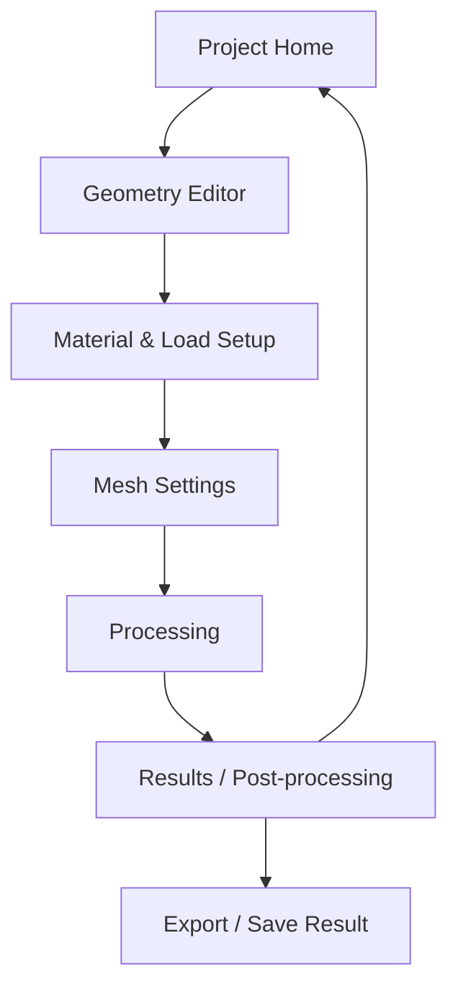

# Design System — Mobile-based FEA Meshing System

## 1. Purpose

This document defines the visual language, UI components, screen layout, interaction patterns, visualization dashboard, and implementation-level design rules for the Mobile-based FEA Meshing System.

The design system is intended to keep the application consistent while supporting an engineering-focused workflow: project management, geometry editing, simulation configuration, processing status, result visualization, mesh quality inspection, and export.

---

## 2. Design Direction

### Visual Style

The application should follow a **Clean Engineering Dashboard** style.

The UI should feel:

- Professional.
- Technical.
- Clear.
- Data-driven.
- Lightweight.
- Mobile-friendly.
- Suitable for an academic engineering software demo.

The app should not feel like a generic form application. It should communicate that it is an engineering simulation and information system through:

- Dashboard cards.
- Mesh visualization.
- Grid/canvas surfaces.
- Engineering metrics.
- Pipeline status.
- Result layers.
- Structured project records.

### Product Experience Statement

> The app should feel like a compact mobile engineering lab where users can define geometry, configure simulation parameters, run a backend FEA pipeline, and inspect results through a visual dashboard.

---

## 3. Design Principles

### Clarity First

Every screen should make the next action clear. Users should always understand:

- What step they are in.
- What data is required.
- What the system is processing.
- What result is being shown.

### Visualize the Engineering Process

The app should visualize the simulation workflow instead of hiding it behind a single button.

Examples:

- Show pipeline steps during processing.
- Show mesh layers in results.
- Show metric cards for mesh/result summary.
- Show support and load markers on canvas.

### Mobile-first Engineering Interaction

Because the system is mobile-based, complex engineering controls should be simplified through:

- Bottom sheets.
- Step-based forms.
- Canvas-first previews.
- Compact metric cards.
- Toggles for visualization layers.

### Separate Input, Processing, and Result States

The UI should clearly separate:

- Geometry input.
- Material/load setup.
- Mesh setup.
- Backend processing.
- Result visualization.
- Export and storage.

### Honest Technical Feedback

Errors should be shown as friendly technical cards, not raw exceptions.

---

## 4. Color System

### Primary Palette

| Token | Color | Usage |
|---|---|---|
| `primary` | `#1D4ED8` | Main actions, active tabs, primary mesh/deformed mesh |
| `primaryLight` | `#3B82F6` | Highlights, progress, secondary actions |
| `background` | `#F9FAFB` | App background |
| `surface` | `#FFFFFF` | Cards, modals, panels |
| `textPrimary` | `#111827` | Main text |
| `textSecondary` | `#6B7280` | Secondary labels |
| `border` | `#E5E7EB` | Dividers, canvas grid, card borders |
| `success` | `#10B981` | Success status |
| `warning` | `#F59E0B` | Warning state |
| `error` | `#DC2626` | Error, bad elements, invalid state |
| `muted` | `#9CA3AF` | Disabled/low-priority UI |

### Semantic Usage

- Use blue for active engineering state and valid simulation result.
- Use red only for error, invalid geometry, bad element, or solver failure.
- Use green for completed processing or successful simulation.
- Use gray for original mesh, gridlines, disabled states, and helper text.

### Mesh Visualization Colors

| Layer | Color |
|---|---|
| Original mesh | `#111827` with dashed opacity |
| Deformed mesh | `#1D4ED8` |
| Fixed supports | `#DC2626` |
| Load vectors | `#F59E0B` or `#DC2626` |
| Bad elements | `#DC2626` |
| Contour low | Light blue |
| Contour high | Red/orange |
| Canvas grid | `#E5E7EB` |

---

## 5. Typography

### Font Direction

Use system font in React Native while following an Inter/SF Pro-like hierarchy.

Recommended:

- iOS: SF Pro default.
- Android: Roboto default.
- Numeric/coordinate values: monospace if available.

### Type Scale

| Role | Size | Weight | Usage |
|---|---:|---:|---|
| Screen title | 20–24 | 700–800 | Main screen heading |
| Section title | 16–18 | 700 | Card sections |
| Card metric | 22–28 | 700–800 | Node count, element count, max displacement |
| Body | 14–16 | 400–500 | Descriptions, form text |
| Label | 12–14 | 600–700 | Input labels, badges |
| Helper | 11–12 | 400–500 | Units, hints, metadata |
| Numeric/Code | 12–14 | 500–600 | Coordinates, displacements, matrix values |

### Text Rules

- Use sentence case for labels.
- Use concise technical wording.
- Avoid long paragraphs inside mobile screens.
- Prefer metric cards and compact explanations.
- Use monospace for coordinate lists and exported JSON preview.

---

## 6. Spacing and Layout

### Spacing Scale

| Token | Value |
|---|---:|
| `xs` | 4 |
| `sm` | 8 |
| `md` | 12 |
| `lg` | 16 |
| `xl` | 24 |
| `2xl` | 32 |
| `3xl` | 40 |

### Radius Scale

| Token | Value | Usage |
|---|---:|---|
| `sm` | 6 | Small badges, inputs |
| `md` | 8 | Buttons, controls |
| `lg` | 12 | Cards |
| `xl` | 16 | Dashboard cards |
| `2xl` | 20 | Bottom sheets/modals |

### Layout Rules

- Use safe area on all screens.
- Use 16–24 px horizontal padding.
- Keep primary actions near the bottom on mobile.
- Use bottom sheets for dense configuration.
- Use cards to group engineering parameters.
- Use full-width canvas panels for geometry and result visualization.

---

## 7. Core Components

### Primary Button

Purpose:
- Start simulation.
- Save project.
- Export result.
- Continue to next step.

Style:
- Background: `primary`.
- Text: white.
- Height: 44–52.
- Border radius: 8.
- Font weight: 600–700.

States:
- Default.
- Pressed.
- Disabled.
- Loading.

### Secondary Button

Purpose:
- Back.
- Reset shape.
- Edit input.
- Retry.

Style:
- Background: `#F3F4F6`.
- Text: `textPrimary` or `primary`.
- Border optional.

### Icon Button

Purpose:
- Back.
- More.
- Zoom.
- Export.
- Layer settings.

Style:
- 36–44 square touch target.
- Rounded.
- Icon color based on state.

### Engineering Card

Purpose:
- Group overview, metrics, mesh quality, solver status, or material summary.

Style:
- Background: white.
- Border: `#E5E7EB`.
- Radius: 12–16.
- Padding: 16–20.
- Optional shadow/elevation.

### Metric Card

Purpose:
Display numeric result information.

Examples:
- Nodes.
- Elements.
- Max displacement.
- Bad elements.
- Mesh stability.
- Processing time.

Structure:

```text
Label
Value
Supporting metadata/badge
```

### Input Field

Purpose:
- Geometry dimensions.
- Material parameters.
- Mesh density.
- Load vector.

Rules:
- Always show unit label when applicable.
- Validate numeric input.
- Show helper text for invalid input.
- Use numeric keyboard where possible.

### Bottom Sheet

Purpose:
- Material settings.
- Mesh settings.
- Boundary condition form.
- Export options.
- Layer controls.

Style:
- Rounded top corners.
- Drag handle.
- Clear title.
- Scrollable content.
- Sticky primary action at bottom.

### Status Badge

Purpose:
- Draft.
- Processing.
- Success.
- Failed.
- Saved.
- Exported.

Colors:
- Draft: gray.
- Processing: blue.
- Success: green.
- Failed: red.

---

## 8. Visualization Components

### Engineering Canvas

Purpose:
- Geometry preview.
- Mesh visualization.
- Deformation visualization.
- Result contour.

Canvas should include:
- Grid lines.
- X/Y axes.
- Unit labels.
- Scaled object preview.
- Optional node/element markers.

### Mesh Layer Renderer

Layers:
- Original Mesh.
- Deformed Mesh.
- Fixed Supports.
- Load Vectors.
- Contour.
- Node IDs.
- Element IDs.
- Bad Elements.

Each layer should be independently toggleable in the target design.

### Layer Toggle Panel

Purpose:
Allow users to turn visualization layers on/off.

Example:

```text
[✓] Original Mesh
[✓] Deformed Mesh
[ ] Contour
[✓] Fixed Supports
[✓] Load Vectors
[ ] Node IDs
[ ] Element IDs
```

### Quality Dashboard

The Mesh Quality Dashboard should include:

- Stats cards:
  - Node count.
  - Element count.
  - Bad elements.
  - Max aspect ratio.
- Quality checklist:
  - Area check.
  - Aspect ratio check.
  - Inverted element check.
- Highlight option:
  - Highlight bad elements on canvas.

### Result Dashboard

The Result Dashboard should include:

- Mesh canvas.
- Layer toggles.
- Displacement summary.
- Mesh quality summary.
- Boundary condition summary.
- Export button.
- Simulation metadata:
  - Element type.
  - Algorithm.
  - Processing time.
  - Scale factor.

---

## 9. Screen Flow

### Target Screen Flow



### Bottom Tabs

Target bottom tabs:

```text
Projects
Simulate
Library
Settings
```

### Stack Flow

Inside the Simulate tab:

```text
Geometry Editor
→ Material & Load Setup
→ Mesh Settings
→ Processing
→ Results / Post-processing
```

---

## 10. Screen Specifications

### Project Home

Purpose:
- Show project history.
- Create/open project.
- Show overview metrics.

Content:
- Header with app icon and title.
- Overview dashboard card.
- Recent projects list.
- Project status badges.
- Floating create button.

Important dashboard metrics:
- Total projects.
- Saved simulations.
- Last run status.
- Storage usage if implemented.

Primary action:
- Create project / Start simulation.

Empty state:
- "No simulation projects yet."
- CTA: "Create first project."

---

### Geometry Editor

Purpose:
- Define simulation geometry visually.

Layout:
- Header with back button and step label.
- Large visual canvas.
- Geometry tool selector.
- Bottom sheet for dimensions or coordinates.
- Preview of generated nodes/points.

Target geometry modes:
- Rectangle.
- Polygon coordinate list.
- Import data as future work.

Canvas-first behavior:
- Show preview before simulation.
- Show axis ticks.
- Show dimensions.
- Show coordinate points.

Validation:
- Width and height must be positive.
- Polygon must have at least three valid points.
- Polygon points must not be duplicated.

---

### Material & Load Setup

Purpose:
- Configure material and boundary conditions.

Sections:
1. Material properties:
   - Young's modulus.
   - Poisson's ratio.
   - Thickness.
   - Unit system.
2. Boundary conditions:
   - Fixed edge.
   - Load point.
   - Force X.
   - Force Y.

Design:
- Use grouped cards.
- Use unit labels.
- Use technical helper text.
- Provide canvas preview for supports and loads.

Boundary editor target:
- Hybrid interaction:
  - Tap edge/node on canvas if available.
  - Form fallback always available.

---

### Mesh Settings

Purpose:
- Configure meshing algorithm and density.

Inputs:
- Algorithm:
  - Structured.
  - Delaunay.
- Element type:
  - Quad.
  - Triangle.
- nx.
- ny.
- minAngleDeg.
- maxArea.

UI:
- Segmented controls for algorithm/type.
- Numeric fields for density.
- Advanced settings collapsible panel.
- Preview summary.

Validation:
- nx and ny must be positive integers.
- Triangle settings should be disabled if T3 is not implemented.
- Delaunay should show "Target feature" if not implemented.

---

### Processing Screen

Purpose:
- Show backend simulation progress and system pipeline.

Pipeline steps:

```text
Validating Input
Generating Mesh
Assembling Matrix
Solving System
Post-processing
```

Visual style:
- Progress bar.
- Step checklist.
- Spinner or animated engineering icon.
- Current status message.

Success state:
- "Simulation completed."
- Auto-navigation to results or button "View Results."

Error state:
- Friendly technical error card.
- Actions:
  - Retry.
  - Edit input.
  - View details.

---

### Results / Post-processing Dashboard

Purpose:
- Visualize simulation output and mesh quality.

Main sections:
1. Visualization canvas.
2. Layer toggle panel.
3. Result metrics.
4. Mesh quality dashboard.
5. Displacement table.
6. Export actions.

Canvas layers:
- Original mesh.
- Deformed mesh.
- Contour.
- Fixed supports.
- Load vectors.
- Bad elements.
- Node IDs.
- Element IDs.

Metric cards:
- Nodes.
- Elements.
- Max displacement.
- Bad element count.
- Processing time.
- Scale factor.

Quality checklist:
- Area check.
- Aspect ratio check.
- Inverted element check.

Export:
- Export JSON package.
- Future: export image/PDF.

---

## 11. Error and Empty States

### Server Unreachable

Message:

```text
Unable to reach the FEA backend server.
Please make sure the FastAPI server is running on port 8000.
```

Actions:
- Retry.
- Edit server URL.
- Go back.

### Invalid Geometry

Message:

```text
The geometry input is invalid.
Check dimensions or polygon coordinates and try again.
```

Actions:
- Edit geometry.
- View details.

### Mesh Generation Failed

Message:

```text
Mesh generation failed for the current geometry and mesh settings.
Try reducing constraints or using a structured rectangle mesh.
```

Actions:
- Edit mesh settings.
- Retry.

### Solver Failed

Message:

```text
The solver could not complete the simulation.
Check boundary conditions and loads.
```

Actions:
- Edit boundary conditions.
- Retry.

### No Result Available

Message:

```text
No FEA result is available yet.
Run a simulation to view mesh and displacement results.
```

Action:
- Start simulation.

---

## 12. Interaction Patterns

### Step-based Input

Use step-by-step flow instead of one dense form:

```text
Geometry → Material/Load → Mesh → Process → Results
```

### Canvas-first Editing

Whenever possible, show a visual preview first and place numeric controls in a bottom sheet.

### Progressive Disclosure

Advanced settings should be collapsed by default:
- minAngleDeg.
- maxArea.
- future adaptive settings.

### Toggle-based Result Exploration

Users should explore result layers through toggles instead of navigating away.

### Save and Export After Simulation

After a successful simulation:
- Save result locally.
- Offer JSON export.
- Update project history.

---

## 13. Component Naming Recommendation

Recommended components:

```text
ProjectCard
OverviewCard
MetricCard
StatusBadge
PrimaryButton
SecondaryButton
IconButton
EngineeringCanvas
MeshLayerRenderer
LayerTogglePanel
QualityChecklist
ProcessingPipeline
ErrorCard
BottomSheet
ParameterInput
CoordinateTable
ExportSheet
```

---

## 14. Implementation Notes for React Native

### SVG Rendering

Use `react-native-svg` for:
- Mesh lines.
- Polygons.
- Axes.
- Grid.
- Support markers.
- Load vectors.
- Contour approximation.

### Performance

For small demo meshes, rendering all elements directly is acceptable.

For larger meshes:
- Avoid rendering node labels by default.
- Use layer toggles.
- Consider simplifying display.
- Avoid unnecessary re-rendering.

### API State

Each API call should have:

- `idle`
- `loading`
- `success`
- `error`

### Form Validation

Validate before sending to backend:

- Positive dimensions.
- Valid material constants.
- `0 < poissonRatio < 0.5`.
- Positive thickness.
- Positive mesh density.
- Valid force vector.

---

## 15. Dashboard as Information System Evidence

To emphasize the Information Systems direction, the app should demonstrate that simulation data is treated as managed information, not just temporary computation.

The dashboard should show:

- Project metadata.
- Simulation metadata.
- Mesh summary.
- Result summary.
- Quality status.
- Exportable data.
- Local history.

This helps position the system as a full application with structured data management, not only a mathematical script.

---

## 16. Design Status Matrix

| UI Feature | Status | Priority |
|---|---|---|
| Project Home | Implemented baseline | P0 |
| Geometry Editor | Implemented baseline | P0 |
| Processing Screen | Implemented baseline | P0 |
| Results Mesh View | Implemented baseline | P0 |
| Engineering Dashboard Metrics | Target | P1 |
| Layer Toggles | Target | P1 |
| Quality Checklist | Target | P1 |
| AsyncStorage Project History | Target | P1 |
| JSON Export Sheet | Target | P1 |
| Boundary Condition Editor | Target | P2 |
| Displacement Contour | Target | P2 |
| Advanced Polygon UI | Target | P2 |
| Dark/scientific theme | Future Work | Future |
